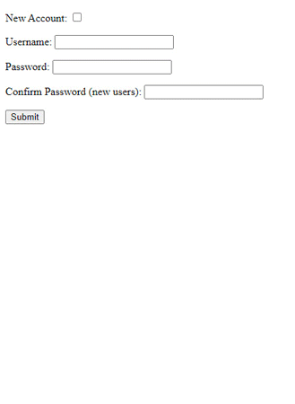

# Number Guessing Game
 
 

## Author 
Cecilia harvey 
 

## Description:
This is a simple game used as an introduction to Web Application development in my CS 3750 class.  
This project is hosted on a remote server and used a SQL database for data persistence.  
Originally, this website was also SSL certified.  
To see this web app in use, visit this link [Number Guessing Game](www.cs3750spring2022.epizy.com)  
 

## Usage 
- Click Login
- Create an account, or log in with an account you've already created. 
- Click Start Your Game
- Guess a number between 1-100 (inclusive), then click submit. 
- When you guess correctly, you will be directed to a high scores page. 
- When you guess incorrectly, it will give you a hint and you must click Guess Again to continue playing.
- At any time you may click Log Out to go back to the login screen.
- After completing the game, you can select Play Again or Log Out.
 

## Tools Used
- SQL Database: The database was a MySQL database hosted on the server side. 
- PHP: PHP was used to pass information from the client to the server
- HTML: The pages were structured with HTML
- SSL: I went through the process of getting an SSL certificate for this website.
- Visual Studio Code: Visual Studio is the IDE used to write my code 
 
